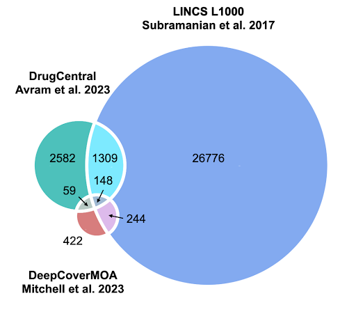
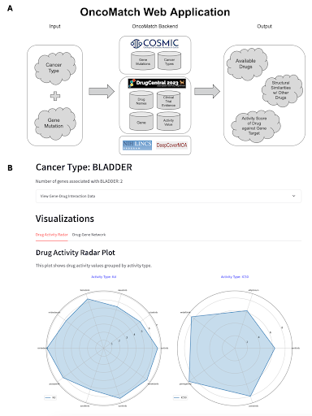
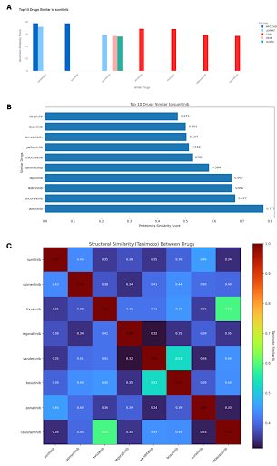

*co-first authors

## Abstract

Advances in precision medicine are reshaping cancer treatment by tailoring therapies to a patient’s specific genetic profile. Despite this, matching cancer mutations to effective drugs remains a complex task due to variability in mutations across cancer types and limited tools for practical clinical application. In this project, initially developed during the BioIT Hackathon 2025, we created OncoMatch—an open-data-powered web application designed to bridge this gap by integrating genomic, transcriptomic, proteomic, and drug-target interaction data to support therapy selection.
Building on prior work in colorectal cancer, we expanded our scope to include bladder, ovarian, and non-small cell lung cancer (NSCLC), using the COSMIC and DrugCentral databases to identify relevant gene mutations and therapeutics. We developed two novel scoring systems—the Cancer Precision Score (CPS) and Gene Precision Score (GPS)—to evaluate drug specificity and potential effectiveness. Using data from DrugCentral, LINCS L1000, and DeepCoverMOA, we created a unified bioactivity dataset for over 4,000 drugs, including measures such as IC50 and Kd values.
The OncoMatch platform features interactive tools to visualize drug bioactivity, assess multi-omic and structural similarity among compounds, and explore potential drug combinations. Users can query drugs by cancer type and gene mutation, generating insights into the most promising therapies and alternatives.
Our open source approach not only democratizes access to high quality bioinformatics tools but also encourages data driven, personalized cancer care. Future directions include refining subtype level predictions and improving the platform’s utility for combinatorial therapy planning.  We have developed a streamlit app to make it easy to access this data.  That app can be found at https://oncomatchapp-precision-medicine.streamlit.app.

## Introduction 

Choosing the right treatment for cancer patients is becoming more personalized thanks to advances in precision medicine. By looking closely at the genetic mutations in a patient's tumor, doctors can now select therapies that are more likely to work for that specific cancer. However, even with powerful genetic tools available, it is still very difficult to match a patient's unique cancer profile to the best drug or drug combination. The process is complicated because cancer mutations vary widely, and many existing approaches are either focused on only one cancer type or are not built for real-world clinical use.
While earlier research has shown that combining genetic information with drug activity data can help suggest potential treatments, these methods have mostly been limited to small studies or specific cancers. There is still a major need for a broader, scalable system that can help doctors and researchers match genetic mutations to targeted therapies across different cancer types, and do so in a way that is evidence-based and practical for clinical decision-making.
In this project, we are addressing this gap by expanding previous methods (Kubica et al., 2022), developing new scoring systems to measure how precisely drugs target cancer mutations, and creating tools utilizing open-source data to better support treatment selection. 
Our goal is to make cancer therapy more data-driven, personalized, and effective for patients across a wider range of cancers.

## Methods

Preliminary work was done on this project prior to the advent of the BioIT Hackathon, which we expanded upon here. The prior work done identified potentially effective colorectal cancer drugs by integrating genetic data with drug effectiveness scoring. We have expanded upon this work by including several other cancer types with consensus molecular subtypes (CMS), namely colorectal cancer, bladder cancer, ovarian cancer, and non-small cell lung cancer (NSCLC) (Kubica et al., 2022). Additionally, we enhanced diagnostics by leveraging DrugCentral, which is a database providing comprehensive information on a vast range of therapeutics, to map current therapeutics to genetic biomarkers of cancer types, and developing an evidence-based scoring system to predict the effectiveness of drug combinations in a clinical setting. By advancing these efforts, we seek to contribute to precision medicine practices by making cancer treatment more personalized and data driven.

OncoMatch is the web app we developed to match the cancer and gene mutation type to the most effective drug therapy based on the activity score (IC50 and Kd) of the drug against the specific gene target. We utilize the COSMIC database to identify the gene mutations for specific cancer types and the DrugCentral database to identify the drug therapies and the specific genes they target.

We have also developed scoring guides to better understand how precisely different therapeutics are targeting cancer types. 

The Cancer Precision Score measures how specifically a drug targets a gene of interest (GOI) within a particular cancer type. It is calculated by dividing the number of drug–gene interactions for a cancer type by the total number of genes associated with that cancer. A higher CPS indicates a more focused and potentially effective therapeutic option for that cancer type.

The Gene Precision Score measures how specifically a drug targets a particular gene relative to all genes the drug can affect. It is calculated by dividing the number of drug–gene interactions for a cancer type by the total number of genes that the drug targets overall. A higher GPS suggests that the drug has a more selective effect on the gene of interest, which may lead to fewer off-target effects

## Results

### Building a Unified Bioactivity and Omics Dataset for OncoMatch
DrugCentral provides integrated data on drug structures, targets, mechanisms, and regulatory status for FDA- and globally approved compounds. Over the years, it has compiled target–drug interaction data—including IC50, EC50, Kd, and Ki values—for over 3365 UniProt proteins and 4927 drugs. (Avram et al. 2023) More recently, DrugCentral incorporated transcriptomic drug perturbation data from the LINCS L1000 dataset, (Subramanian et al. 2017), which measured changes in the expression of 978 “landmark” genes following treatment with 19811 compounds. Since the release of the DrugCentral 2023 update, a complementary study-DeepCoverMOA (Mitchell et al. 2023)-quantified drug-induced changes at the proteomic level using mass spectrometry to capture protein-level responses in across 875 compounds. 
Together, we parsed and mapped these datasets to generate the input data for our OncoMATCH framework. Of the 4099 total drugs with SMILES cataloged in DrugCentral (accessed April 2025), 1457 were matched to compounds profiled in LINCS L1000 (accessed April 2025) and 207 to those in DeepCoverMOA (Figure 1). 

Figure 1. Overlap of drugs shared between DrugCentral (Avram et al. 2023), LINCS L1000 (Subramanian et al. 2017), and DeepCoverMOA (Mitchell et al. 2023).

### Establishing a User Interface for OncoMatch

We developed an interactive web application as part of the OncoMATCH framework to provide intuitive exploration and prioritization of drug candidates. The architecture of the application is outlined in Figure 2A, which shows how user input is processed through harmonized backend datasets to generate dynamic visualizations and outputs. Using our integrated dataset on target–drug activities, transcriptomic perturbations, and proteomic responses, the application provides public access to query multi-omic drug profiles in a cancer-type–specific context.

Users can begin by selecting a cancer type-such as bladder, ovarian, colon or NSCLC. These options were selected because they are known to exhibit molecular subtypes, which can influence drug response and therapeutic strategies. (McConkey et al. 2018, Rudin et al. 2019, Guinney et al. 2015, Tothill et al. 2008), For each cancer type, we curated a set of driver genes using data from the COSMIC database, (Sondka et al. 2018) forming the basis for our downstream drug-gene interaction analysis. 

Upon selection, the application displays the drug bioactivity panel (Figure 2B), which visualizes experimentally derived interactions between drugs in the DrugCentral database and the cancer-associated genes. This view includes two radar plots that summarize reported Kd or IC50 values for compounds across the curated driver genes associated with the selected cancer type. Lower Kd values indicate stronger binding affinity, while lower IC50 values reflect higher potency. These plots provide a comparative view of compound bioactivity, emphasizing those with strong target engagement and potent inhibitory effects across cancer-type-specific driver genes.

Figure 2. OncoMatch Web Application. (A) Overview of the OncoMatch workflow, including user input, backend data integration, and output generation. (B) Screenshot of the interactive web interface, which allows users to explore bioactivity values, specifically Kd and IC50, of genes associated with a selected cancer type.

### Exploring Drug Combinations and Mechanistic Similarity Using OncoMatch

The OncoMatch interface includes interactive modules for investigating compound similarity across transcriptomic, proteomic, chemical structure contexts, facilitating hypothesis generation around potential drug combinations and shared mechanisms of action. These modules enable users to inspect how selected compounds relate to others based on molecular response profiles or structural features—providing a broader view of potential functional analogs or complementary therapies.

After establishing compounds with lower Kd and IC50 values for cancer-type-specific targets (Figure 2B), users can explore additional panels to examine multi-omic and structural similarities across compounds. The transcriptomics panel (Figure 3A) displays the top ten drugs with the highest gene expression profile similarity, grouped by cell line. This permits users to compare transcriptional responses both within and across cell lines, helping identify compounds with cell line-specific effects or broadly conserved signatures. 

Next, the proteomics panel (Figure 3B) highlights similarity between the protein-level effects of compound treatments in the HCT116 cell line. This section shows the top ten drugs with the most similar proteomic response profiles to a selected compound, allowing users to analyze compounds with analogous multi-omic effects that may serve as candidates for combinatorial therapies targeting shared pathways or mechanisms.

Finally, the structure panel (Figure 3C) presents a heatmap of Tanimoto similarity scores between a selected compound and others identified through transcriptomic or proteomic similarity. Tanimoto similarity compares molecular fingerprints-bitwise representations of structural features-and ranges from 0 (no shared features) to 1 (identical encoded structural features). (Bajusz et al. 2015) This view equips users to assess structure-activity relationships, offering a foundation for exploring whether structurally similar compounds exhibit shared molecular responses.

This data can be easily accessed in the app here - https://oncomatchapp-precision-medicine.streamlit.app.  

Figure 3. Compound similarity views within the OncoMatch web application. A) Bar plot showing the top 10 compounds with the highest transcriptomic similarity to a selected compound, based on LINCS L1000 gene expression profiles, grouped by cell line. B) Bar plot showing the top 10 compounds with the most similar proteomic response profiles in the HCT116 cell line, based on DeepCoverMOA data. C) Heatmap of Tanimoto similarity scores between a selected compound and compounds identified by transcriptomic or proteomic similarity.

## Discussion and Future Work

We have built a unified bioactivity and omics dataset, established a user interface for OncoMATCH, and explored drug combinations and mechanistic similarity using the established platform. Unfortunately, the platform we have built is limited to data of broad cancer types including colorectal cancer, NSCLC, bladder cancer, and ovarian cancer as opposed to more specific data on their subtypes. This was due to resource limitations (namely time and data), but we plan to address this in future work.

Future work will include tracking down molecular subtype driver mutation gene data for colorectal cancer, ovarian cancer, NSCLC, and bladder cancer. The OncoMATCH therapeutic matching capabilities will be expanded to include the subtypes of these specific cancers, as was done in the initial work with colorectal cancer. By applying the CPS and GPS gene scoring, we could identify potentially effective therapeutic combinations to target cancer subtypes for treatment. Alternatively, similarity scoring of therapeutics could be expanded upon to predict effective drug combinations - including protein-level responses across compounds. 

## Jupyter notebooks, GitHub repositories and data repositories

GitHub Repository: 
https://github.com/BioITHackathons/DrugCentral-Based-Review-and-Profiles-of-Targets-for-Approved-Drugs.git

Preprocess raw data: 
https://github.com/BioITHackathons/DrugCentral-Based-Review-and-Profiles-of-Targets-for-Approved-Drugs/blob/main/notebooks/1_preprocess_raw_data.ipynb

Calculate drug score: 
https://github.com/BioITHackathons/DrugCentral-Based-Review-and-Profiles-of-Targets-for-Approved-Drugs/blob/main/notebooks/2_calculate_drug_score.ipynb

Calculate Structure Similarity: 
https://github.com/BioITHackathons/DrugCentral-Based-Review-and-Profiles-of-Targets-for-Approved-Drugs/blob/main/notebooks/3_calculate_structure_similarity.ipynb

DeepCoverageMOA: 
https://github.com/BioITHackathons/DrugCentral-Based-Review-and-Profiles-of-Targets-for-Approved-Drugs/blob/main/notebooks/4_deepcoveragemoa.ipynb

OncoMatch WebApp: 
https://oncomatchapp-precision-medicine.streamlit.app/

## Acknowledgements

The results here are in large part based on data found in Drug Central: https://drugcentral.org/
Thank you to the organizers of the BioIT World Conference and Expo Hackathon 2025- particularly Allissa Dillman of the Common Fund Data Ecosystem (CFDE) for making it all happen!
Finally, we would like to thank the members of the Biohackathon Europe 2022 group who did foundational work and highlighted the path for this project: Jędrzej Kubica, Emerson Huitt, Yusuke Suita, Amanda S. Khoo, Hyonyoung Shin, David Enoma, Nick Giangreco, and Ben Busby. 

### Disclosures 

Ben Busby is a full time employee of NVIDIA. 
Manasi is a full time employee of Takeda Pharmaceuticals. 
Shelby is a full time employee of AbbVie Inc. 
Lisa is a full time employee of Momentum Biotechnologies. 
Stanislaw is a full time employee and founder of Deepflare.
